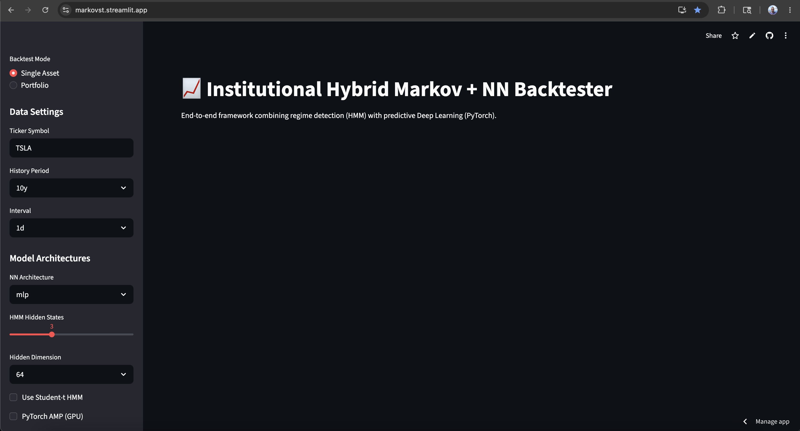
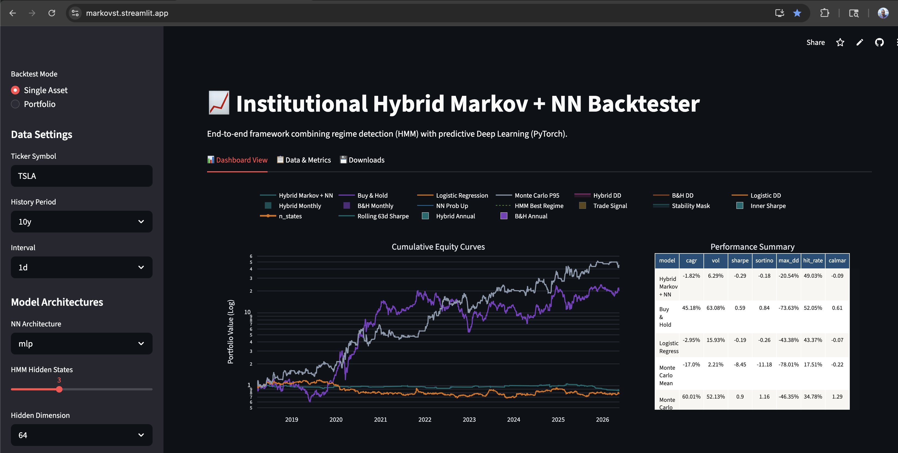
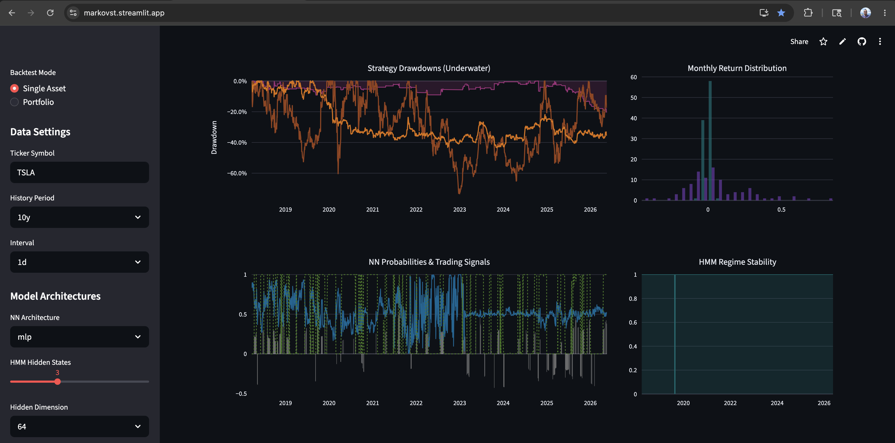
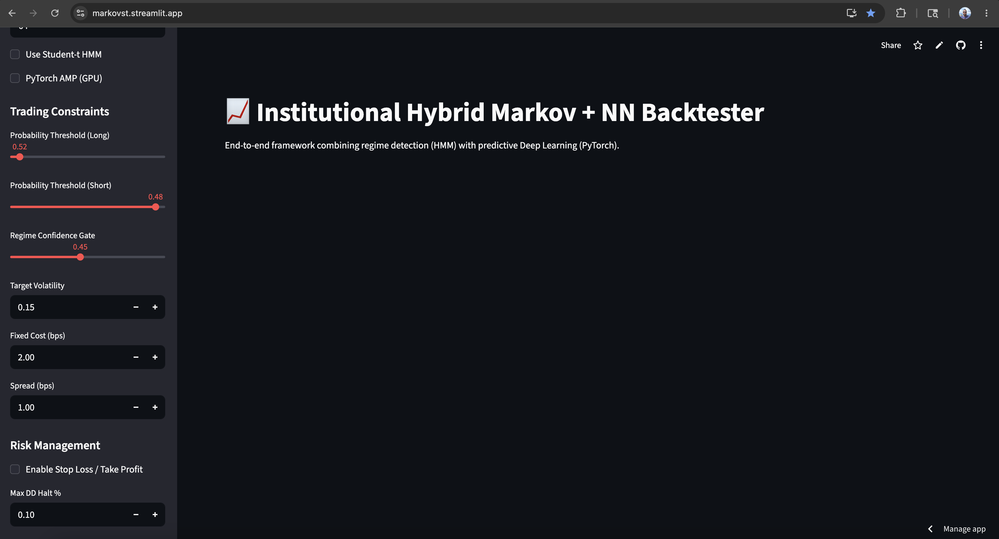
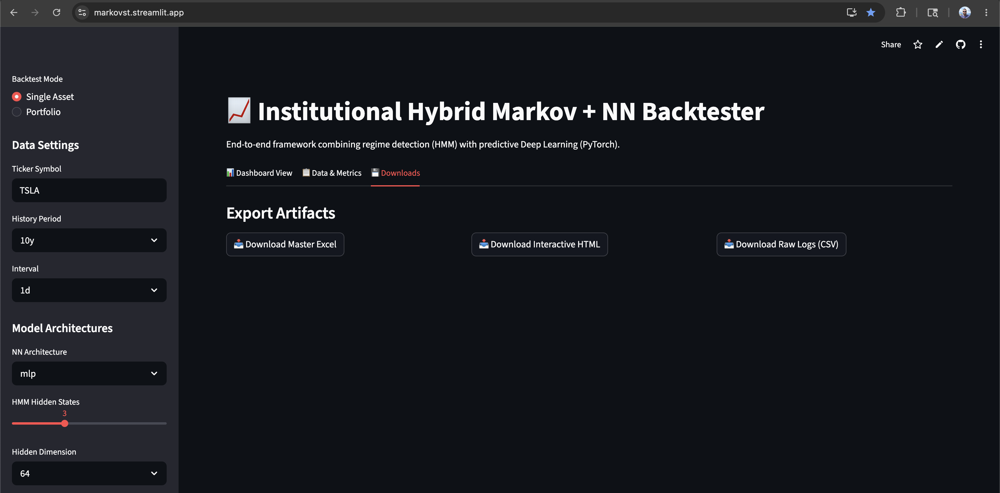

<p align="center">
  <h1 align="center">📈 Hybrid Markov + Neural Network Backtester</h1>
  <p align="center">
    <strong>Quantitative Trading Framework</strong><br>
    Combining Hidden Markov Models for Regime Detection with PyTorch Neural Networks for Signal Generation
  </p>
  <p align="center">
    <a href="#-quick-start">Quick Start</a> •
    <a href="#-visual-walkthrough">Visual Walkthrough</a> •
    <a href="#-streamlit-ui--complete-guide">UI Guide</a> •
    <a href="#-how-the-math-works-and-why-it-matters">Math</a> •
    <a href="#-installation">Installation</a> •
    <a href="#-who-benefits-and-how">Benefits</a>
  </p>
</p>

---

## 📑 Table of Contents

<details>
<summary><strong>Click to expand full table of contents</strong></summary>

1. [Overview](#-overview)
2. [Who Benefits and How](#-who-benefits-and-how)
3. [Installation](#-installation)
4. [Quick Start](#-quick-start)
5. [Visual Walkthrough](#-visual-walkthrough)
6. [Streamlit UI — Complete Guide](#-streamlit-ui--complete-guide)
   - [Backtest Mode](#1-backtest-mode)
   - [Data Settings](#2-data-settings)
   - [Model Architectures](#3-model-architectures)
   - [Trading Constraints](#4-trading-constraints)
   - [Risk Management](#5-risk-management)
   - [Hyperparameter Tuning](#6-hyperparameter-tuning)
   - [Validation & Walk-Forward](#7-validation--walk-forward)
   - [Run Backtest Button](#8-run-backtest)
7. [What's New — CS 230 Paper Integration](#-whats-new--cs-230-paper-integration)
8. [Architecture](#-architecture)
9. [How the Math Works and Why It Matters](#-how-the-math-works-and-why-it-matters)
10. [Understanding the Outputs](#-understanding-the-outputs)
11. [Pipeline Deep Dive](#-pipeline-deep-dive)
12. [Code Architecture](#-code-architecture)
13. [How It Works — Decision Flow](#-how-it-works--decision-flow)
14. [Example Recipes](#-example-recipes)
15. [Extending the Framework](#-extending-the-framework)
16. [Known Limitations](#-known-limitations)
17. [Academic References](#-academic-references)
18. [Project Structure](#-project-structure)
19. [Performance Notes](#-performance-notes)
20. [Troubleshooting](#-troubleshooting)
21. [Dependencies](#-dependencies)
22. [Contributing](#-contributing)
23. [License](#-license)

</details>

---

## 🔭 Overview

### What This Project Does

This system predicts whether stock prices will go **up or down tomorrow**, then automatically decides whether to **buy, sell, or stay flat** — all while managing risk like a professional trading desk.

It combines two powerful ideas:

1. **Hidden Markov Models (HMM)** — A statistical method that identifies the latent "mood" of the market (bull, bear, or uncertain). Think of it as a weather forecast for market regimes: before you act on a trade signal, you first check whether conditions are clear enough to act.

2. **Deep Learning Neural Networks (PyTorch)** — Four different AI architectures (MLP, ResNet, LSTM, Transformer) that learn patterns from 21 technical indicators to predict price direction.

The key innovation is that **the HMM acts as a gatekeeper**: the neural network's predictions are only acted upon when the market is in a clear, stable regime. This prevents the system from trading during chaotic, unpredictable periods and is the main reason the strategy avoids large drawdowns during crash events.

### Core Innovation: Regime-Gated Prediction

Most ML trading systems train a classifier and act on every signal. This system adds a second layer of logic:

```
Signal VALID only if:
  1. Market regime is stable (HMM confidence ≥ gate threshold)
  2. Regime has been consistent (no frequent flipping)
  3. NN probability clears the long or short threshold
  4. Position sized by realized volatility
```

This architecture is directly inspired by institutional systematic trading desks that separate *regime identification* from *signal generation*.

### System Architecture

```
┌─────────────┐    ┌──────────────┐    ┌───────────────┐    ┌──────────────┐
│  Yahoo      │───▶│  Feature     │───▶│  HMM Regime   │───▶│  PyTorch     │
│  Finance    │    │  Engineering │    │  Detection    │    │  Neural Net  │
│  (OHLCV)    │    │  (21 feats)  │    │  (Cholesky)   │    │  (4 archs)   │
└─────────────┘    └──────────────┘    └──────┬────────┘    └──────┬───────┘
                                              │                    │
                   ┌──────────────┐    ┌──────▼────────┐           │
                   │  Streamlit   │◀───│  Walk-Forward │◀──────────┘
                   │  Dashboard   │    │  Backtesting  │
                   │  + Exports   │    │  + Optuna     │
                   └──────────────┘    └───────────────┘
```

---

## 💰 Who Benefits and How

### For Hedge Funds & Asset Managers

- **Regime-aware trading** — HMM detects market shifts before your portfolio takes a hit
- **Walk-forward validation** — No overfitting; each fold trains only on past data
- **Statistical rigor** — Deflated Sharpe Ratio separates real alpha from luck
- **Transaction cost modeling** — Backtest Sharpe won't collapse when you go live

### For Retail & Algorithmic Traders

- **One-click operation** — Pick a ticker, click Run, get results
- **Built-in benchmarks** — Compared against Buy & Hold, Logistic Regression, and 500 random traders
- **Risk management** — Stop-losses, trailing stops, circuit breakers built in
- **No coding required** — Every parameter adjustable via sidebar sliders

### For Portfolio Managers

- **Multi-asset mode** — Run backtests across multiple tickers simultaneously
- **Correlation-adjusted weights** — Highly correlated assets get reduced allocation
- **Diversification metrics** — Full correlation matrix in output

### For Researchers & Students

- **Complete codebase** — Single file (`app.py`, ~1,800 lines), fully readable
- **CS 230 paper integration** — Stanford research informs the search space
- **Extensible** — Add new architectures in 20 lines, new features in 1 line

---

## 🛠️ Installation

```bash
git clone https://github.com/ranjithvijik/markovst.git
cd markovst
python -m venv markov-env
source markov-env/bin/activate  # Windows: markov-env\Scripts\activate
pip install -r requirements.txt
```

### Verify Installation

```bash
python -c "import torch; import hmmlearn; import optuna; import streamlit; print('✅ All dependencies ready!')"
```

**Expected output:** `✅ All dependencies ready!`

If any import fails, install the missing package individually:

```bash
pip install torch hmmlearn optuna streamlit yfinance plotly openpyxl scikit-learn
```

### Python & Hardware Requirements

| Requirement | Minimum | Recommended |
|---|---|---|
| Python | 3.8+ | 3.10+ |
| RAM | 4 GB | 8+ GB |
| CPU | Any | 4+ cores |
| GPU | Not required | NVIDIA CUDA (for AMP) |
| Disk | 500 MB | 1 GB |

---

## ⚡ Quick Start

```bash
streamlit run app.py
```

Open the app at `http://localhost:8501`, configure the strategy from the sidebar, and click **🚀 Run Backtest**.

**Fastest test (under 15 seconds):**
1. Ticker: `SPY`
2. History: `10y`
3. Architecture: `mlp`
4. Uncheck **Enable Optuna Tuning**
5. Click **🚀 Run Backtest**

See the **Visual Walkthrough** below for a screenshot-based tour of all inputs, outputs, and export artifacts.

---

## 📸 Visual Walkthrough

This app follows a simple workflow: configure the backtest in the sidebar → run the experiment → inspect the dashboard → validate the metrics → export artifacts.

---

### Step 1 — Configure Inputs

The left sidebar is the control center for the entire experiment. It is organized into six sections: Data Settings, Model Architectures, Trading Constraints, Risk Management, Hyperparameter Tuning, and Validation & Walk-Forward.

#### Top sidebar: asset selection and model settings



> **What you're seeing:** The top panel sets the ticker (`TSLA`), history period (`10y`), interval (`1d`), NN architecture (`mlp`), HMM hidden states (`3`), and hidden dimension (`64`).

#### Middle sidebar: advanced model options


> **What you're seeing:** Options for Student-t HMM (for fat-tailed assets like crypto), PyTorch AMP (GPU acceleration), and the Trading Constraints section controlling long/short probability thresholds, regime confidence gate, and target volatility.

#### Lower sidebar: risk, tuning, and run button


> **What you're seeing:** Transaction cost settings (fixed cost and spread in bps), risk management (stop loss / take profit / max drawdown halt), Optuna hyperparameter tuning, walk-forward validation splits, and the red **🚀 Run Backtest** button.

---

### Step 2 — Review the Dashboard

Once you click **🚀 Run Backtest**, the app produces a multi-panel interactive dashboard under the **Dashboard View** tab.

#### Main dashboard — equity curves and performance table



> **What you're seeing:** Log-scale cumulative equity curves for all strategies (Hybrid Markov+NN in teal, Buy & Hold in grey, Logistic Regression in orange, Monte Carlo strategies in purple/white). The embedded Performance Summary table on the right shows CAGR, Vol, Sharpe, Sortino, Max DD, Hit Rate, and Calmar for each model.

**How to read the equity curves:**
- A rising curve = compounding gains over time
- Log scale means equal vertical distances = equal percentage moves
- The gap between the hybrid model and Buy & Hold reflects the strategy's alpha (or lack thereof)
- Flat sections = the system was in FLAT (no position) due to regime gating

#### Dashboard diagnostics — walk-forward tuning and statistical significance



> **What you're seeing (top left):** Walk-Forward Hyperparameter Tuning Log — bar heights show the number of hidden states selected per fold; the orange line shows the best Optuna trial number per fold. This lets you see whether tuning is consistent across time periods.
>
> **What you're seeing (top right):** Statistical Significance table — Sharpe point estimate, 95% confidence interval, PSR vs Zero (probability Sharpe > 0), Deflated SR, T-Statistic, P-Value, and whether the result is significant at 5%. A p-value above 0.05 means you cannot reject the null hypothesis that the strategy has zero edge.
>
> **What you're seeing (bottom left):** Rolling 63-Day Sharpe Ratio — shows how the strategy's risk-adjusted performance evolves over time. Sustained positive values indicate consistent alpha; large negative swings indicate regime mismatch periods.
>
> **What you're seeing (bottom right):** Annual Returns (%) bar chart — compares the hybrid strategy's year-by-year returns against Buy & Hold.

#### Dashboard signals and drawdowns


> **What you're seeing (top):** Strategy Drawdowns (Underwater) — shows the percentage decline from peak for each strategy over time. Shallower drawdowns = better capital preservation.
>
> **What you're seeing (bottom left):** NN Probabilities & Trading Signals — the teal line is the NN's up-probability; green/red markers are actual long/short signals; grey markers show periods of FLAT (no signal, typically due to regime gate).
>
> **What you're seeing (bottom right):** HMM Regime Stability — shows the fraction of time the model spends in each identified regime state. Dominant stable regimes (tall bars) indicate the HMM has found clean market phases.

---

### Step 3 — Validate the Metrics

The **Data & Metrics** tab surfaces all quantitative outputs in tabular form for auditing.



> **What you're seeing:**
> - **Performance Summary** (top): CAGR, volatility, Sharpe, Sortino, max drawdown, hit rate, and Calmar ratio for each strategy. Compare the Hybrid Markov+NN row against Buy & Hold and Logistic Regression to assess whether the complexity is justified.
> - **Statistical Tests** (bottom left): Formal hypothesis tests on the strategy Sharpe. Key fields: `psr_vs_zero` (should be > 0.95 for confidence), `psr_z_score`, and `deflated_sr`.
> - **Monthly Returns** (bottom right): Month-by-month return table across all strategies. Use this to identify seasonal patterns, drawdown clusters, or recovery periods.

**Key metrics to check first:**

| Metric | What it means | Good value |
|---|---|---|
| `cagr` | Compound annual growth rate | > benchmark CAGR |
| `sharpe` | Risk-adjusted return (annualized) | > 0.5 |
| `sortino` | Like Sharpe but penalizes only downside | > 1.0 |
| `max_dd` | Worst peak-to-trough loss | > -30% (less negative) |
| `hit_rate` | % of trades that were profitable | > 50% |
| `calmar` | CAGR / abs(max drawdown) | > 0.5 |
| `psr_vs_zero` | Probability Sharpe > 0 | > 0.95 |

---

### Step 4 — Export Artifacts

The **Downloads** tab provides three export formats for sharing, archiving, or further analysis.



> **What you're seeing:** Three download buttons — Master Excel (multi-sheet workbook), Interactive HTML (self-contained Plotly dashboard), and Raw Logs CSV (daily signals, probabilities, returns).

**When to use each:**

| Export | Best for |
|---|---|
| **Master Excel** | Offline analysis, sharing with non-technical stakeholders, pivot tables |
| **Interactive HTML** | Sharing the full dashboard — opens in any browser, no Python needed |
| **Raw Logs CSV** | Custom research, importing into other tools, regime analysis |

---

### Step 5 — Recommended Reading Order

After every backtest run, review results in this order to avoid being misled by surface-level metrics:

1. **Statistical Tests** — check `psr_vs_zero` and p-value first. If the edge isn't statistically meaningful, don't act on any other metric.
2. **Performance Summary** — compare CAGR, Sharpe, and max drawdown against Buy & Hold.
3. **Equity Curves** — inspect the shape of the curve. Consistent uptrend is more trustworthy than a single spike.
4. **Drawdowns** — check if drawdowns are shallow and short, or deep and prolonged.
5. **Signals / Regimes** — confirm the model is trading in stable regimes and not just getting lucky in quiet periods.
6. **Downloads** — export everything for audit trail.

---

## 🖥️ Streamlit UI — Complete Guide

The entire system is controlled through the **left sidebar** in the Streamlit interface. This section explains every option, what values you can select, and when to change them.

---

### 1. Backtest Mode

```
┌─────────────────────────────┐
│  Backtest Mode              │
│  ● Single Asset             │
│  ○ Portfolio                │
└─────────────────────────────┘
```

| Option | What It Does |
|---|---|
| **Single Asset** | Runs the full backtest pipeline on ONE ticker symbol. Produces equity curves, drawdowns, signals, and statistical tests for that single asset. |
| **Portfolio** | Runs independent backtests on MULTIPLE tickers, then combines them into a portfolio with correlation-adjusted weights. Produces portfolio-level equity curves, correlation matrix, and asset allocation pie chart. |

**When to use each:**

| Scenario | Choose |
|---|---|
| Testing a strategy on SPY | Single Asset |
| Testing a strategy on BTC-USD | Single Asset |
| Building a diversified portfolio across SPY, QQQ, GLD, TLT | Portfolio |
| Comparing how the model performs on different assets | Run Single Asset multiple times |

**Portfolio Mode Details:**
- Enter tickers as comma-separated values: `SPY, QQQ, GLD, TLT`
- Each ticker gets its own independent backtest (no cross-asset information leakage)
- Results are combined using equal weights, then adjusted for correlation (pairs with correlation > 0.7 get 0.8× weight penalty)
- Minimum 2 successful backtests required for portfolio aggregation

---

### 2. Data Settings

```
┌─────────────────────────────┐
│  Data Settings              │
│                             │
│  Ticker Symbol              │
│  [TSLA                   ]  │
│                             │
│  History Period             │
│  [10y              ▼]       │
│                             │
│  Interval                   │
│  [1d               ▼]       │
└─────────────────────────────┘
```

#### Ticker Symbol

| Field | Details |
|---|---|
| **Type** | Text input |
| **Default** | `SPY` |
| **Format** | Standard Yahoo Finance ticker format |

**Valid examples:**

| Asset Class | Examples |
|---|---|
| US Equities | `SPY`, `QQQ`, `AAPL`, `TSLA`, `MSFT` |
| Crypto | `BTC-USD`, `ETH-USD`, `SOL-USD` |
| Commodities | `GLD` (gold), `SLV` (silver), `USO` (oil) |
| Bonds | `TLT` (20yr treasury), `IEF` (7-10yr) |
| International | `EWJ` (Japan), `FXI` (China), `EFA` (developed) |
| Volatility | `VIXY` (VIX futures) |

**Tips:**
- Use `BTC-USD` not `BTCUSD` for crypto
- Delisted tickers will cause errors — use currently active symbols
- ETFs generally work better than individual stocks (more data, less noise)

#### History Period

| Period | Approximate Data Points | Best For |
|---|---|---|
| `1y` | ~252 trading days | Quick tests, recent regime analysis |
| `2y` | ~504 trading days | Short-term strategy validation |
| `5y` | ~1,260 trading days | Medium-term strategies, includes 1-2 market cycles |
| **`10y`** | **~2,520 trading days** | **Recommended default — includes multiple bull/bear cycles** |
| `max` | All available history | Maximum statistical power, but older data may be less relevant |

> ⚠️ **Minimum requirement:** The system needs at least 60 data points. With 5 CV splits, you realistically need 2+ years of daily data.

#### Interval

| Interval | What It Means | When to Use |
|---|---|---|
| **`1d`** | Daily bars (OHLCV per day) | **Default and recommended** — most technical indicators are calibrated for daily data |
| `1wk` | Weekly bars | Longer-term strategies, less noise, fewer signals |

> **Why no intraday?** RSI, MACD, and Bollinger Bands are calibrated for daily timeframes. Using hourly data would require recalibrating all indicator lookback periods.

---

### 3. Model Architectures

```
┌─────────────────────────────┐
│  Model Architectures        │
│                             │
│  NN Architecture            │
│  [mlp              ▼]       │
│                             │
│  HMM Hidden States          │
│  [═══════●═══════] 3        │
│  min: 2        max: 5       │
│                             │
│  Hidden Dimension           │
│  [64               ▼]       │
│                             │
│  ☐ Use Student-t HMM       │
│  ☐ PyTorch AMP (GPU)       │
└─────────────────────────────┘
```

#### NN Architecture

| Architecture | How It Works | Strengths | Weaknesses | Speed |
|---|---|---|---|---|
| **`mlp`** | 3 layers, BatchNorm, ReLU, Dropout | Fast, reliable baseline, works well with tabular features | Cannot model sequential patterns | ⚡ Fastest |
| **`resnet`** | MLP with skip connections (residual blocks) | Deeper representations without gradient vanishing | Slightly slower, may overfit on small data | ⚡ Fast |
| **`lstm`** | Recurrent network with memory cells + attention | Captures sequential patterns (e.g., "3 down days → reversal") | Slower to train, needs sequence length tuning | 🐢 Slow |
| **`transformer`** | Self-attention mechanism over sequence | Long-range dependencies, parallelizable | Slowest, needs more data to avoid overfitting | 🐢 Slowest |

**Code anatomy of the MLP (from `app.py`):**
```python
class MLPNet(nn.Module):
    def __init__(self, input_dim, hidden_dim=64, dropout=0.2):
        super().__init__()
        self.net = nn.Sequential(
            nn.Linear(input_dim, hidden_dim),
            nn.BatchNorm1d(hidden_dim),
            nn.ReLU(),
            nn.Dropout(dropout),
            nn.Linear(hidden_dim, hidden_dim // 2),
            nn.ReLU(),
            nn.Dropout(dropout),
            nn.Linear(hidden_dim // 2, 1),
            nn.Sigmoid()           # outputs P(price up tomorrow)
        )
    def forward(self, x):
        if x.dim() == 3: x = x[:, -1, :]   # take last timestep for LSTM input
        return self.net(x)
```

**ResNet skip connection — why it helps:**
```python
# Standard MLP: output = layer2(layer1(x))
# ResNet:        output = layer2(layer1(x)) + x   ← skip adds original input back
# This lets gradients flow directly backwards, enabling deeper networks without vanishing gradients
```

**When to use each:**

| Scenario | Recommended |
|---|---|
| First run / quick test | `mlp` |
| Speed-to-performance ratio | `mlp` or `resnet` |
| Sequential patterns (momentum, mean reversion) | `lstm` |
| GPU available + 10y data | `transformer` |
| CS 230 paper replication | `lstm` with `seq_len=30` |

#### HMM Hidden States

**What it means:** How many distinct "market moods" the HMM tries to identify.

| States | Interpretation | When to Use |
|---|---|---|
| `2` | Bull vs Bear | Crypto, assets with clear binary regimes |
| **`3`** | **Bull / Bear / Uncertain (recommended)** | **Most assets — captures the "I don't know" state** |
| `4` | Bull / Mild Bull / Mild Bear / Bear | Assets with gradual regime transitions |
| `5` | Very granular detection | Only with 10y+ data — more states = more overfitting risk |

**Guidance:**
- **Start with 3** — it's the most interpretable and most stable
- **Use 2 for crypto** — sharper transitions, binary regimes work better
- **Avoid 5** unless you have 10+ years of data

#### Hidden Dimension

The number of neurons per hidden layer — controls the model's *capacity* to learn complex patterns.

| Value | Capacity | When to Use |
|---|---|---|
| `32` | Low | Small datasets (<3 years), fast iteration |
| **`64`** | **Medium (recommended)** | **Default for most use cases** |
| `128` | High | Large datasets (10y+), when 64 underfits |

> **CS 230 paper used 50 neurons.** Our search space of [32, 64] brackets this value.

#### Use Student-t HMM

| Setting | Distribution | Best For |
|---|---|---|
| **Unchecked** | Gaussian — bell-shaped returns | Most assets, faster, well-tested |
| **Checked** | Student-t (ν=5) — heavy tails | Crypto, volatile small-caps, crash-prone assets |

**Why Student-t matters:** Financial returns have *fat tails* — extreme moves happen far more often than a normal distribution predicts. The Student-t distribution with ν=5 degrees of freedom explicitly models this, making the HMM more robust to outliers during regime estimation.

```
Gaussian:   P(5σ move) ≈ 0.00003%   ← underestimates crashes
Student-t:  P(5σ move) ≈ 0.2%       ← more realistic for markets
```

#### PyTorch AMP (GPU)

Enables Automatic Mixed Precision training — uses 16-bit floats for matrix multiplications, 32-bit for accumulations.

```
CPU only:     AMP has no effect (safely ignored)
NVIDIA GPU:   AMP ≈ 2× faster training, ~2× less VRAM usage
Requirement:  NVIDIA GPU + CUDA toolkit + torch built with CUDA support
```

> ⚠️ In rare cases, AMP can cause NaN losses due to float16 underflow. If you see unstable training, disable it.

---

### 4. Trading Constraints

```
┌─────────────────────────────┐
│  Trading Constraints        │
│                             │
│  Probability Threshold (Long)│
│  [═══════════●══] 0.52      │
│  min: 0.50      max: 0.99   │
│                             │
│  Probability Threshold (Short)│
│  [══●═══════════] 0.48      │
│  min: 0.01      max: 0.50   │
│                             │
│  Regime Confidence Gate     │
│  [═══════●══════] 0.45      │
│  min: 0.00      max: 1.00   │
│                             │
│  Target Volatility          │
│  [0.15                  ]   │
│                             │
│  Fixed Cost (bps)           │
│  [2.00                  ]   │
│                             │
│  Spread (bps)               │
│  [1.00                  ]   │
└─────────────────────────────┘
```

#### Probability Threshold (Long) and Short

The neural network outputs P(price up tomorrow) ∈ [0, 1]. These two thresholds define three zones:

```
[SHORT]  ←── prob_short ──── FLAT (no trade) ────  prob_long ──→  [LONG]
          e.g. ≤0.48           0.48 to 0.52            ≥0.52
```

The **dead zone** between thresholds prevents trading on weak, ambiguous signals. Widening this gap (e.g., 0.45 / 0.55) reduces trade frequency but increases signal quality.

| Setting | Behavior |
|---|---|
| `prob_long = 0.52` (default) | Go LONG when NN is slightly more than 50% confident |
| `prob_short = 0.48` (default) | Go SHORT when NN is slightly more than 50% bearish |
| `prob_short = 0.01` | **Long-only mode** — never shorts |
| Wide gap (0.45 / 0.55) | Fewer trades, higher conviction only |
| Tight gap (0.499 / 0.501) | Trades nearly every day — high friction cost |

#### Regime Confidence Gate

The HMM outputs a posterior probability for each regime at each timestep. The gate requires this probability to exceed a threshold before a trade signal is valid.

```
LONG trade valid only if:  P(bull_state | data) ≥ regime_gate
SHORT trade valid only if: P(bear_state | data) ≥ regime_gate
Otherwise:                 Signal = FLAT
```

| Value | Effect |
|---|---|
| `0.00` | Gate disabled — trade regardless of regime clarity |
| `0.30` | Low bar — more trades, some noise |
| **`0.45`** | **Moderate (recommended)** — good balance |
| `0.60` | High conviction only — fewer but cleaner trades |
| `1.00` | Effectively no trades (impossible to satisfy) |

> **Why this matters:** During regime transitions (bull → bear), HMM probabilities are diffuse (e.g., 35%/30%/35%). Trading in this uncertainty amplifies losses. The gate forces the model to wait for a clear regime before acting.

#### Target Volatility

The system scales position size to target a specific annualized portfolio volatility:

```
position_t = min(σ_target / σ̂_{t-1}, 1.5)
```

Where σ̂_{t-1} is yesterday's realized volatility (20-day rolling standard deviation of returns, annualized).

**Worked examples:**

| Market Condition | σ̂_{t-1} | Position Size (target=15%) |
|---|---|---|
| Very calm | 8% | min(15/8, 1.5) = **1.5× (max leverage)** |
| Normal | 16% | min(15/16, 1.5) = **0.94×** |
| Volatile | 25% | min(15/25, 1.5) = **0.60×** |
| Crash (VIX spike) | 60% | min(15/60, 1.5) = **0.25×** |

> Set `target_vol = 0` to disable position sizing entirely and always trade at 1× notional.

#### Transaction Costs

Total cost per trade (both entry and exit) is:

```
cost = (fixed_cost_bps + spread_bps) × 2 × position_value × 0.0001
```

| Asset Type | Recommended `fixed_cost` | Recommended `spread` |
|---|---|---|
| SPY, QQQ (ETFs) | 1–2 bps | 0.5–1 bps |
| Large-cap stocks | 2 bps | 1–2 bps |
| Small-caps | 2–5 bps | 5–15 bps |
| Crypto | 5–10 bps | 3–10 bps |

---

### 5. Risk Management

```
┌─────────────────────────────┐
│  Risk Management            │
│                             │
│  ☐ Enable Stop Loss /       │
│    Take Profit              │
│                             │
│  Stop Loss %      [0.02]    │
│  Take Profit %    [0.05]    │
│  Max DD Halt %    [0.10]    │
└─────────────────────────────┘
```

#### Stop Loss and Take Profit

When enabled, these apply *intraday* rules that override the model's signal:

```python
# Stop Loss: close position if loss exceeds threshold from entry
if (current_price / entry_price - 1) * direction < -stop_loss_pct:
    close_position()

# Take Profit: lock in gains when target is reached
if (current_price / entry_price - 1) * direction > take_profit_pct:
    close_position()
```

**Rule of thumb:** Take-profit should be ≥ 2× stop-loss to maintain a positive reward:risk ratio.

| Stop Loss | Take Profit | Reward:Risk |
|---|---|---|
| 2% | 5% | 2.5:1 ✅ |
| 2% | 2% | 1:1 ❌ (needs > 50% win rate to be profitable) |
| 5% | 10% | 2:1 ✅ |

#### Max DD Halt

A portfolio-level **circuit breaker**: if total drawdown from peak exceeds this threshold, all trading halts for the remainder of that fold.

```
peak = max(portfolio_value over time)
drawdown = (portfolio_value - peak) / peak

if drawdown < -max_dd_halt:
    halt_all_trading()     # no resumption in this fold
```

> ⚠️ **Important:** Once triggered, trading does NOT resume. This intentionally simulates a fund manager pulling the plug after a defined loss event.

---

### 6. Hyperparameter Tuning

```
┌─────────────────────────────┐
│  Hyperparameter Tuning      │
│                             │
│  ☑ Enable Optuna Tuning    │
│                             │
│  Optuna Trials per Fold     │
│  [═══●═════════════] 5      │
│  min: 1         max: 50     │
└─────────────────────────────┘
```

**Optuna** uses Tree-structured Parzen Estimator (TPE) Bayesian optimization to intelligently search the hyperparameter space:

**Search space (CS 230 enhanced):**

| Parameter | Search Space | CS 230 Best |
|---|---|---|
| `n_states` | [2, 3, 4] | — |
| `architecture` | [mlp, resnet] | — |
| `hidden_dim` | [32, 64] | 50 |
| `dropout` | [0.10, 0.20, 0.35] | **0.10** |
| `lr` | [5e-4, 1e-3] | — |
| `batch_size` | [32, 64] | **32** |
| `seq_len` | [20, 30, 40] | **30** |

**How Optuna works per fold:**
```
Trial 1–2:  Random exploration (no prior knowledge)
Trial 3+:   TPE builds a model of P(good params | past trials)
            Samples from the promising region
Best trial: Its hyperparameters used for the final outer-fold model
```

| Trials | Quality | Runtime/fold | Use When |
|---|---|---|---|
| `1` | Random | ~30 sec | Debugging only |
| **`5`** | **Good (recommended)** | **~2–3 min** | **Default** |
| `10` | Better | ~5–7 min | More time available |
| `15` | Thorough | ~8–12 min | Final validation |
| `50` | Exhaustive | ~30–40 min | Overnight research |

---

### 7. Validation & Walk-Forward

```
┌─────────────────────────────┐
│  Validation & Walk-Forward  │
│                             │
│  CV Splits                  │
│  [═══════●═════════] 5      │
│  min: 2         max: 10     │
│                             │
│  ☐ Anchored Walk-Forward   │
└─────────────────────────────┘
```

#### Why Walk-Forward?

Traditional train/test splits leak the future into the training set. Walk-forward validation ensures the model only ever learns from past data and is always evaluated on unseen future data:

```
ROLLING (default):
Fold 1: [====TRAIN====][TEST]
Fold 2:    [====TRAIN====][TEST]
Fold 3:       [====TRAIN====][TEST]    ← Same train size each fold

ANCHORED:
Fold 1: [====TRAIN====][TEST]
Fold 2: [=======TRAIN=======][TEST]
Fold 3: [==========TRAIN==========][TEST]    ← Growing train size
```

**When to use each:**

| Rolling (default) | Anchored |
|---|---|
| Market structure changes over time | All history is relevant |
| Recent data matters more | Maximum training data for final folds |
| Most assets | Long-running, stable indices (e.g., SPY 20y+) |

#### CV Splits Guidance

| Splits | Test Periods | Data Recommendation |
|---|---|---|
| `2–3` | 2–3 out-of-sample periods | Only 1–3 years of data |
| **`5`** | **5 periods (recommended)** | **5–15 years of data** |
| `7–10` | 7–10 periods | 15+ years; maximum statistical power |

---

### 8. Run Backtest

```
┌─────────────────────────────┐
│  [🚀 Run Backtest        ]  │
└─────────────────────────────┘
```

**What happens when you click:**

1. Configuration assembled from all sidebar values
2. Data downloaded from Yahoo Finance (cached 1 hour)
3. 21 technical features computed (RSI, MACD, Bollinger Bands, etc.)
4. Walk-forward loop begins:
   - Per fold: Optuna tunes → HMM fits → NN trains → signals generated → performance computed
5. Results compiled into equity curves, statistics, and export files
6. Dashboard appears across three tabs: **Dashboard View**, **Data & Metrics**, **Downloads**

**Progress indicators shown during run:**
- Progress bar: `Fold 3/5`
- Status text: `Tuning Optuna Trial 4/5`
- Final: `✅ Execution Completed in 187.3s`

---

## 🚀 What's New — CS 230 Paper Integration

This framework incorporates findings from Stanford CS 230 [8], which tested 6 LSTM configurations:

| Model | Layers | Dropout | Batch Size | Best RMSE (FB) |
|---|---|---|---|---|
| 1 | 4 | 0.2 | 32 | 5.61 |
| 2 | 4 | 0.1 | 32 | 6.98 |
| 3 | 3 | 0.2 | 32 | 5.24 |
| **4** | **3** | **0.1** | **32** | **4.89 ✓ (best)** |
| 5 | 3 | 0.2 | 64 | 6.68 |
| 6 | 3 | 0.1 | 64 | 6.36 |

**Key findings integrated into our Optuna search space:**
- **Dropout 0.10** outperforms 0.20 → Search: `[0.10, 0.20, 0.35]`
- **Batch size 32** outperforms 64 → Search: `[32, 64]`
- **Timestep 30** used as default → Search: `[20, 30, 40]`

---

## 🏗️ Architecture

### The 6-Stage Pipeline

| Stage | What Happens | Why It Matters |
|---|---|---|
| **1. Data** | Downloads OHLCV with retry logic | Handles API failures gracefully |
| **2. Features** | 21 technical indicators | Transforms price noise into learnable signals |
| **3. HMM** | Classifies market regime via Baum-Welch EM | Prevents trading in chaotic, uncertain markets |
| **4. Neural Net** | Predicts P(price up tomorrow) | Core directional prediction engine |
| **5. Validation** | Walk-forward + Optuna Bayesian tuning | Ensures genuinely out-of-sample performance |
| **6. Reporting** | Excel + HTML + CSV export | Professional artifacts for analysis and sharing |

### Feature Engineering (21 Indicators)

The 21 features computed from raw OHLCV data include:

| Category | Features |
|---|---|
| **Trend** | SMA(10), SMA(20), SMA(50), EMA(12), EMA(26) |
| **Momentum** | RSI(14), MACD, MACD Signal, MACD Histogram |
| **Volatility** | Bollinger Band width, ATR(14), realized vol (20d) |
| **Volume** | OBV, Volume z-score |
| **Price** | Log returns, overnight gap, high-low range, close position in range |
| **Regime** | Rolling return skewness, kurtosis |

---

## 🧠 How the Math Works and Why It Matters

### Hidden Markov Model — Reading the Market's Mood

The HMM finds hidden states S ∈ {1,...,K} that explain observed return sequences X₁,...,Xₙ. The model is defined by three components:

**Transition matrix A** — probability of switching regimes:

```
A[i,j] = P(S_{t+1} = j | S_t = i)
```

A high A[bull, bull] (e.g., 0.95) means bull markets are persistent. A low value means frequent switching.

**Emission distribution B** — what returns look like in each regime:

```
b_i(X_t) = N(X_t ; μ_i, Σ_i)        (Gaussian HMM)
b_i(X_t) = t_ν(X_t ; μ_i, Σ_i)     (Student-t HMM, ν=5)
```

**Posterior probability** — the probability of being in state i at time t given all data:

```
γ_t(i) = P(S_t = i | X_1,...,X_n)   (computed via Forward-Backward algorithm)
```

**Cholesky decomposition** for numerical stability (prevents the covariance matrix from becoming non-positive-definite):

```
Σ = L Lᵀ     (Cholesky factorization)
D²(x, μ) = ‖ L⁻¹(x - μ) ‖²         (Mahalanobis distance in whitened space)
```

**Parameters estimated via Baum-Welch EM** — iteratively updates A, μ, and Σ to maximize log-likelihood of the data.

### Neural Networks — Predicting Direction

**LSTM gates** (from CS 230 paper, Model 4):

```
f_t = σ(W_f · [h_{t-1}, x_t] + b_f)                          Forget gate
i_t = σ(W_i · [h_{t-1}, x_t] + b_i)                          Input gate
c_t = f_t ⊙ c_{t-1} + i_t ⊙ tanh(W_c · [h_{t-1}, x_t] + b_c)  Cell update
h_t = σ(W_o · [h_{t-1}, x_t] + b_o) ⊙ tanh(c_t)             Output
```

- `f_t`: decides what fraction of the memory to *forget* (e.g., old trend info)
- `i_t`: decides what new information to *write* to memory
- `c_t`: the memory cell — accumulates information across timesteps
- `h_t`: the hidden state passed to the next timestep and to the output layer

**Attention mechanism** (our enhancement over the CS 230 baseline):

```
α_t = softmax(vᵀ · tanh(W_a · h_t))    ← learned importance weight for each day
context = Σ_t  α_t · h_t               ← weighted combination of all hidden states
output  = sigmoid(W_out · context)      ← P(price up tomorrow)
```

The attention layer learns which of the past `seq_len` days matter most for the prediction, rather than giving all days equal weight.

### Volatility Targeting — Sizing the Bet

```
position_t = min( σ_target / σ̂_{t-1},  1.5 )
```

Where σ̂_{t-1} is the 20-day rolling annualized realized volatility. The 1.5 cap prevents excessive leverage during ultra-calm periods.

```
Calm market (σ=8%):  position = 15%/8%  = 1.875 → capped at 1.5×
Normal (σ=15%):      position = 15%/15% = 1.0×
Volatile (σ=25%):    position = 15%/25% = 0.6×
Crash (σ=60%):       position = 15%/60% = 0.25× (cut 75% of exposure)
```

### Statistical Testing — Is the Edge Real?

The system computes three levels of statistical evidence:

**1. Standard Sharpe Ratio** (annualized):

```
SR = (μ_r - r_f) / σ_r  ×  √252
```

**2. Probabilistic Sharpe Ratio (PSR)** — accounts for non-normality of returns:

```
PSR(SR*) = Φ( (SR̂ - SR*) · √(n-1) / √(1 - γ₃·SR̂ + (γ₄/4)·SR̂²) )
```

Where γ₃ = skewness and γ₄ = excess kurtosis. `PSR(0)` gives P(true Sharpe > 0).

**3. Deflated Sharpe Ratio (DSR)** — corrects for multiple testing bias (trying many parameters and reporting the best):

```
DSR = PSR( E[max SR | N trials] )
```

Where `E[max SR | N trials]` is the expected maximum Sharpe from N random strategies. A high DSR means the edge is genuine even after accounting for the fact that we tried multiple configurations.

> **Practical rule:** If `psr_vs_zero < 0.95` or `p_value > 0.05`, the strategy's edge is not statistically significant — the apparent performance could be due to luck.

---

## 📈 Understanding the Outputs

### Dashboard Tab (10 Panels)

| Panel | What to Look For |
|---|---|
| **1. Cumulative Equity Curves** | Consistent uptrend; hybrid model vs benchmarks |
| **2. Performance Summary** | CAGR > benchmark; Sharpe > 0.5; Max DD manageable |
| **3. Drawdown (Underwater)** | Shallow, short drawdowns indicate risk control working |
| **4. Monthly Return Distribution** | Positive skew; few large negative outliers |
| **5. NN Probabilities & Signals** | Signals clustered in clear regimes; few signals during chaos |
| **6. HMM Regime Stability** | Dominant tall bars indicate clean regime detection |
| **7. Hyperparameter Tuning Log** | Consistent best hyperparams across folds = robust model |
| **8. Statistical Significance** | PSR > 0.95; p-value < 0.05 for real edge |
| **9. Rolling 63-Day Sharpe** | Consistently positive suggests persistent alpha |
| **10. Annual Returns** | No single year driving all returns (concentration risk) |

### Data & Metrics Tab

| Table | Purpose |
|---|---|
| **Performance Summary** | Side-by-side comparison of all strategies on 7 metrics |
| **Statistical Tests** | Formal hypothesis tests — p-value, PSR, deflated Sharpe |
| **Monthly Returns** | Month-by-month return breakdown for all strategies |

### Downloads Tab

| Export | Format | Contents |
|---|---|---|
| **Master Excel** | `.xlsx` | 6 sheets: Summary, EquityCurve, MonthlyReturns, HyperparamLog, StatisticalTests, Configuration |
| **Interactive HTML** | `.html` | Full Plotly dashboard — shareable, opens in any browser |
| **Raw Signals CSV** | `.csv` | Daily signals, probabilities, returns for downstream research |

---

## 🔬 Pipeline Deep Dive

### Feature Engineering → HMM → Neural Net flow

```python
# Step 1: Raw OHLCV → 21 features (simplified)
df['rsi_14'] = compute_rsi(df['Close'], 14)
df['macd']   = ema(df['Close'], 12) - ema(df['Close'], 26)
df['bb_width'] = (upper_band - lower_band) / middle_band
# ... 18 more indicators

# Step 2: HMM fits on feature subset (returns + volatility features)
hmm = GaussianHMM(n_components=n_states, covariance_type='full')
hmm.fit(regime_features)
regimes = hmm.predict(regime_features)           # [0, 0, 1, 2, 0, 1, ...]
posteriors = hmm.predict_proba(regime_features)  # [[0.9, 0.1, 0.0], ...]

# Step 3: NN trained on all features + regime as input
X = np.hstack([all_features, regimes.reshape(-1, 1)])
y = (returns.shift(-1) > 0).astype(int)  # 1 = price up tomorrow
model = MLPNet(input_dim=X.shape[1], hidden_dim=64)
train(model, X_train, y_train)

# Step 4: Signal generation with gating
for t in range(len(test_data)):
    regime_prob = posteriors[t, best_regime]
    nn_prob = model(X[t])

    if regime_stable(t) and regime_prob >= gate:
        if nn_prob >= prob_long:  signal[t] = +1  # LONG
        elif nn_prob <= prob_short: signal[t] = -1  # SHORT
        else:                       signal[t] = 0   # FLAT
    else:
        signal[t] = 0  # FLAT — regime unclear
```

---

## 🗂️ Code Architecture

`app.py` is a single-file application (~1,800 lines) organized into clearly separated sections:

| Lines (approx) | Section | What it does |
|---|---|---|
| 1–80 | Imports & Config | All imports, `@dataclass` config definition |
| 80–200 | Feature Engineering | `compute_features()` — all 21 indicators |
| 200–350 | HMM Layer | `GaussianHMMRegime`, `StudentTHMM` classes |
| 350–550 | Neural Networks | `MLPNet`, `ResNet`, `LSTMNet`, `TransformerNet` |
| 550–750 | Training Loop | `train_model()`, `evaluate_model()`, early stopping |
| 750–950 | Walk-Forward + Optuna | `run_walkforward()`, `optuna_objective()` |
| 950–1100 | Signal Generation | `generate_signals()`, volatility targeting, costs |
| 1100–1300 | Risk Management | Stop-loss, take-profit, trailing stop, DD halt |
| 1300–1500 | Benchmarks | Buy & Hold, Logistic Regression, Monte Carlo |
| 1500–1650 | Statistics | Sharpe, PSR, DSR, skewness, kurtosis |
| 1650–1800 | Streamlit UI | Sidebar, tabs, charts, downloads |

---

## 🚥 How It Works — Decision Flow

Every trading day passes through 5 gates before a position is taken:

```
Day T arrives
    │
    ▼
┌─────────────────────────────────┐
│  GATE 1: Regime Stability       │
│  ≤6 regime flips in 20 days?   │──── NO ──▶ FLAT (regime too noisy)
└───────────────┬─────────────────┘
                │ YES
                ▼
┌─────────────────────────────────┐
│  GATE 2: HMM Confidence        │
│  P(regime) ≥ regime_gate?       │──── NO ──▶ FLAT (regime unclear)
└───────────────┬─────────────────┘
                │ YES
                ▼
┌─────────────────────────────────┐
│  GATE 3: NN Probability         │
│  prob ≥ prob_long?  → LONG      │
│  prob ≤ prob_short? → SHORT     │──── NEITHER ──▶ FLAT (weak signal)
└───────────────┬─────────────────┘
                │
                ▼
┌─────────────────────────────────┐
│  GATE 4: Volatility Sizing      │
│  size = min(σ_target/σ̂, 1.5)   │
└───────────────┬─────────────────┘
                │
                ▼
┌─────────────────────────────────┐
│  GATE 5: Risk Management        │
│  Stop-loss / Take-profit /      │
│  Trailing stop / DD halt        │
└───────────────┬─────────────────┘
                │
                ▼
         Execute Trade (minus transaction costs)
```

---

## 🧪 Example Recipes

| Use Case | Settings | Est. Runtime |
|---|---|---|
| **Quick test** | SPY, 10y, mlp, Optuna OFF | < 15 sec |
| **Standard backtest** | SPY, 10y, mlp, 5 trials, 5 folds | 3–5 min |
| **CS 230 replication** | SPY, 10y, lstm, seq_len=30, 15 trials | 15–20 min |
| **Crypto** | BTC-USD, 5y, mlp, Student-t HMM, vol_target=0 | 3–5 min |
| **Portfolio** | Portfolio mode, `SPY, QQQ, GLD, TLT`, 5 trials | 15–30 min |
| **Conservative** | prob_long=0.55, prob_short=0.45, regime_gate=0.60 | Any |
| **Aggressive** | prob_long=0.51, prob_short=0.49, regime_gate=0.30 | Any |
| **Long-only** | prob_short=0.01 | Any |
| **No risk overlay** | Disable stop loss, max_dd_halt=1.0 | Any |

---

## 🧩 Extending the Framework

### Add a Feature (1 line)

```python
# In compute_features() around line 100:
features["my_indicator"] = close.rolling(10).mean() / close.rolling(50).mean()
```

### Add a Neural Network Architecture (20 lines)

```python
class MyNetwork(nn.Module):
    def __init__(self, input_dim, hidden_dim=64, dropout=0.2, **kwargs):
        super().__init__()
        self.net = nn.Sequential(
            nn.Linear(input_dim, hidden_dim),
            nn.ReLU(),
            nn.Dropout(dropout),
            nn.Linear(hidden_dim, 1),
            nn.Sigmoid()
        )

    def forward(self, x):
        if x.dim() == 3:
            x = x[:, -1, :]     # take last timestep if 3D input
        return self.net(x)
```

Then add `"mynet": MyNetwork` to the `ARCHITECTURE_MAP` dict near the top of `app.py`.

### Add a Custom Risk Rule

```python
# In generate_signals(), after signal generation:
# Example: don't trade if VIX equivalent > 30
realized_vol_annualized = returns.rolling(20).std() * np.sqrt(252)
signals[realized_vol_annualized > 0.30] = 0   # force FLAT in extreme vol
```

---

## 🛑 Known Limitations

| Limitation | Mitigation |
|---|---|
| Gaussian HMM may miss fat tails | Enable Student-t HMM for crypto/volatile assets |
| Assumes regime stability within folds | Use shorter history periods or anchored walk-forward |
| Daily frequency only | `1wk` supported; intraday requires indicator recalibration |
| No market microstructure modeling | Increase spread bps for illiquid assets |
| Survivorship bias possible | Use currently active, liquid tickers |
| No live trading connectivity | Use outputs to inform manual or automated execution |
| Single-asset regime detection | HMM trained per-asset; no cross-asset regime information |

---

## 🎓 Academic References

1. **Hamilton, J.D. (1989).** *"A New Approach to the Economic Analysis of Nonstationary Time Series."* Econometrica.
2. **Gu, S., Kelly, B., & Xiu, D. (2020).** *"Empirical Asset Pricing via Machine Learning."* Review of Financial Studies.
3. **López de Prado, M. (2018).** *Advances in Financial Machine Learning.* Wiley.
4. **Bailey, D.H., & López de Prado, M. (2012).** *"The Sharpe Ratio Efficient Frontier."* Journal of Risk.
5. **Rabiner, L.R. (1989).** *"A Tutorial on Hidden Markov Models."* Proceedings of the IEEE.
6. **Hochreiter, S., & Schmidhuber, J. (1997).** *"Long Short-Term Memory."* Neural Computation.
7. **Vaswani, A., et al. (2017).** *"Attention Is All You Need."* NeurIPS.
8. **Miao, Y. (2020).** *"CS 230: A Deep Learning Approach for Stock Market Prediction."* Stanford University.
9. **Li, A.W. & Bastos, G.S. (2020).** *"Stock Market Forecasting Using Deep Learning."* IEEE Access.

---

## 📁 Project Structure

```
markovst/
├── app.py                   # Complete engine + Streamlit UI (~1,800 lines)
├── README.md                # This file
├── requirements.txt         # Python dependencies
├── LICENSE                  # MIT License
├── .gitignore
└── docs/
    └── images/
        ├── sidebar-overview.jpg        # Top sidebar (ticker, history, model arch)
        ├── sidebar-advanced.jpg        # Middle sidebar (Student-t, AMP, thresholds)
        ├── sidebar-trading-risk.jpg    # Lower sidebar (costs, risk, tuning, run button)
        ├── dashboard-main.jpg          # Main equity curves + performance table
        ├── dashboard-diagnostics.jpg   # Tuning log, stats, rolling Sharpe, annual returns
        ├── dashboard-signals.jpg       # Drawdowns, NN signals, HMM regime stability
        ├── data-metrics-tab.jpg        # Performance summary, statistical tests, monthly returns
        └── downloads-tab.jpg           # Export artifacts panel
```

---

## ⏱️ Performance Notes

| Scenario | Runtime | Memory |
|---|---|---|
| No tuning (mlp) | < 15 sec | ~500 MB |
| MLP, 5 trials, 5 folds | 3–7 min | ~1.5 GB |
| MLP, 15 trials, 5 folds | 8–15 min | ~1.5 GB |
| LSTM, 15 trials, 5 folds | 15–25 min | ~1.5 GB |
| Transformer, 15 trials, 5 folds | 25–40 min | ~2 GB |
| Portfolio (4 assets), 5 trials | 15–30 min | ~1.5 GB |

**Speedup tips:**
- Use `mlp` architecture (fastest)
- Disable Optuna or use 1–3 trials for exploration
- Enable PyTorch AMP if you have an NVIDIA GPU
- Use `1y` or `2y` history for rapid iteration

---

## 🐛 Troubleshooting

| Issue | Solution |
|---|---|
| `"No data returned"` | Check ticker format — use `BTC-USD` not `BTCUSD` |
| `"HMM did not converge"` | Harmless — Cholesky fallback handles it automatically |
| `"Not enough samples"` | Increase history period or decrease CV splits |
| `"CUDA out of memory"` | Reduce hidden dim to 32 or disable PyTorch AMP |
| Very slow runtime | Reduce Optuna trials or disable tuning entirely |
| `"No trades generated"` | Lower `regime_gate` (try 0.30) or narrow prob thresholds |
| NaN losses during training | Disable AMP; reduce learning rate; check for infinite feature values |
| `"Minimum 2 backtests required"` | In Portfolio mode, ensure at least 2 tickers return valid data |
| High overfitting (train >> test Sharpe) | Increase Optuna trials; use rolling (not anchored) walk-forward |

---

## 📦 Dependencies

| Package | Version | Purpose |
|---|---|---|
| `torch` | ≥1.13 | Neural networks (MLP, ResNet, LSTM, Transformer) |
| `hmmlearn` | ≥0.3 | Gaussian HMM regime detection |
| `scipy` | ≥1.9 | Cholesky decomposition, statistical tests |
| `optuna` | ≥3.0 | Bayesian hyperparameter optimization |
| `plotly` | ≥5.0 | Interactive dashboards |
| `openpyxl` | ≥3.0 | Excel workbook generation |
| `streamlit` | ≥1.20 | Web UI |
| `yfinance` | ≥0.2 | Market data download |
| `scikit-learn` | ≥1.0 | Scaling, splitting, logistic regression benchmark |
| `pandas` | ≥1.5 | Data manipulation |
| `numpy` | ≥1.23 | Numerical computation |

---